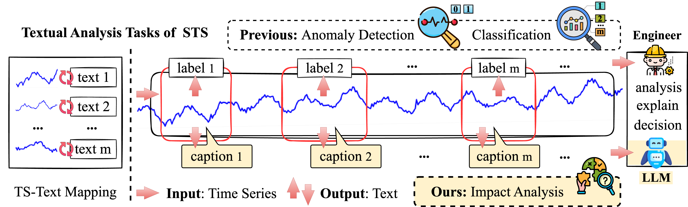
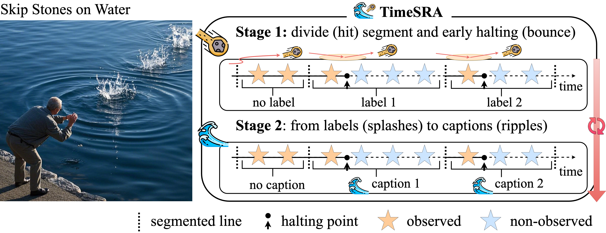
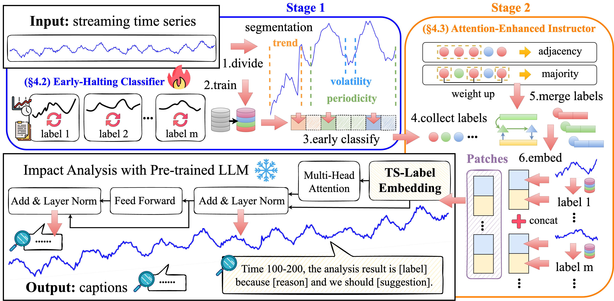

#  TimeSAR: Aligning Streaming Time Series with LLMs for Impact Analysis Rapidly
<!--
        
This code is the official PyTorch implementation of our TKDE'25 paper: 
[Skip Stones on Water](https://arxiv.org/pdf/2412.10859): Aligning Streaming Time Series with LLMs for Impact Analysis.
-->

[New🔥] (2025.3.15) Our survey paper is submitted to **ECML-PKDD 2025, Research Track**!

### Demonstrated Video:
https://private-user-images.githubusercontent.com/55379108/427331266-14c0acfd-5ec1-4144-b2c0-8d7353041ea6.mp4

### Background:

**S**treaming **T**ime **S**eries (STS) is real-time and unbounded, ubiquitous in time-sensitive scenarios for rapid decision-making. For example, early anomaly detection from the network traffic of Internet of Things (IoT) devices to avoid further failure. Applications extend to healthcare, where early and accurate classification of time-series electrocardiogram (ECG) assists doctors in diagnostics and prevention, which is critical for patient survival. Recently, **L**arge **L**anguage **M**odels (LLMs) have demonstrated excellent performance, such as DeepSeek-V3 and GPT-4 that excels at contextual reasoning from time-series pattern to analysis. Aligning STS with LLMs efficiently utilises the zero-shot and few-shot capabilities of LLMs. The related research enables LLMs trained with a finite attention window to generalise to infinite sequence lengths without fine-tuning. 

### Motivation and Contribution:

    

Fig.1: This diagram illustrates the textual analysis tasks of STS, which aim to learn the correlations mapping between time series patterns and additional domain information to observe input STS and output textual results. We focus on analysis captions instead of labels that are not in-depth enough.

  

As shown in **Figure 1**, we regard anomaly detection and classification as textual analysis tasks of STS from the perspective of output textual modality. For example, time-series anomaly detection outputs normal/abnormal labels as textual labels and time-series classification outputs multiple labels. However, the output labels of these tasks lack cognition. For example, "equipment anomaly" must be analysed and explained to guide real-world decision-making as follows: "15\% pressure rise within 20 seconds indicates a possible valve blockage of the located equipment, which leads to a rupture within 2 hours empirically, so immediate maintenance is required to avoid downtime". Unlike output labels that are not in-depth enough, we propose the textual impact analysis task of STS, a novel cognitive task with output captions that have explanations and suggestions.

 

    

Fig.2:  is similar to the process of skipping stones on water.

 
 

We bridge the gap between domain information and dynamically changing patterns of STS. Analogized by skipping stones on water, we propose an impact **A**nalysis method of **S**treaming time series **R**apidly aligning with **LLM**s called **TimeSAR**. We divide the process of skipping stones on water into two stages: (1) hit and bounce rapidly; (2) splashes and ripples, and repeat the above two stages. The first stage involves the divide (hit) segment of STS and the early classification that halts immediately (bounces rapidly) once a label is obtained; the second stage refers to generating captions (ripples) by cognitive diffusion with LLM from labels (splashes), as shown in **Figure 2**.

 

    

Fig.3: The framework of TimeSAR.

 
 

As shown in **Figure 3**, the design of \method has the following components: (1) an **early-halting classifier** improves the real-time analysis efficiency of domain alignment by confidence-based early training and classification on STS segments divided by feature-based segmentation rapidly; (2) a **distribution-adaptive controller** adapts uncertain distribution changes by generates training sets using LLMs and activates co-training by maintaining transferred action of idle and annotated status; (3) an **attention-enhanced instructo**r strengths long-term analysis quality by merging and compressing similar labels based on weight quantisation to reduce memory overhead, and embeds labels and their temporal patterns into LLM to obtain captions for impact analysis.

## Benchmark Results

Our experiments on public datasets from UCR and UEA show that the accuracy of \method significantly outperforms the baselines by up to **12.6 - 23.2%**. In the efficiency, the harmonic mean of accuracy and earliness outperforms the baselines by up to **3.8 - 19.2%**.

