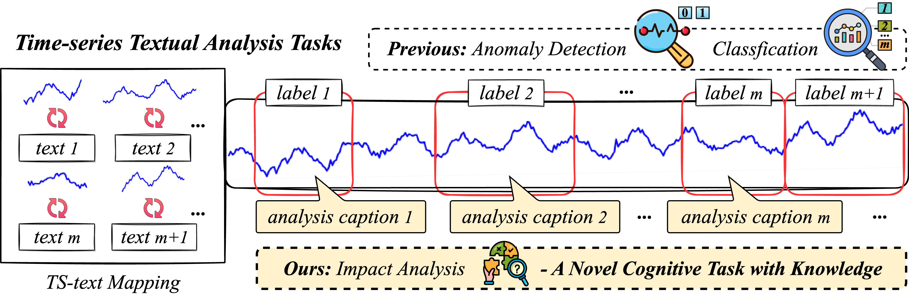
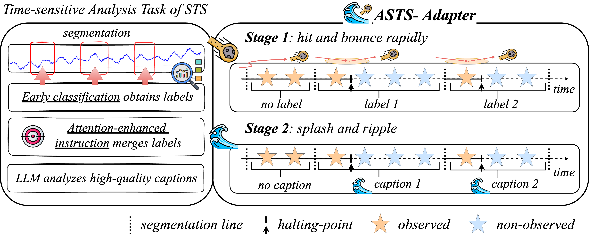
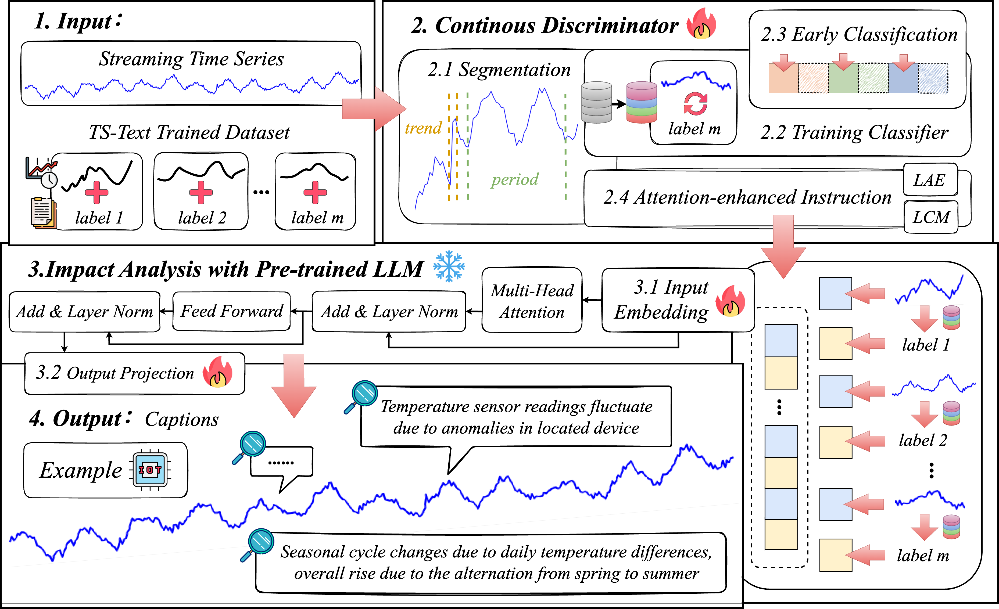
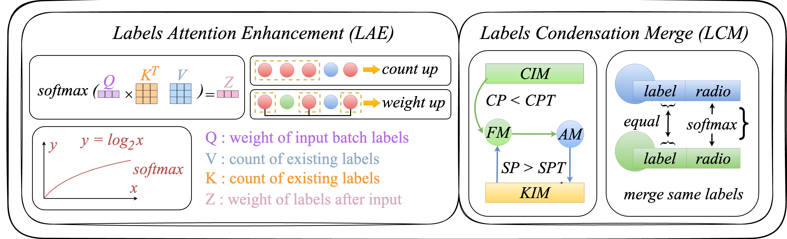

#  Skip Stones on Water: Aligning Streaming Time Series with LLMs for Impact Analysis
<!--
        
This code is the official PyTorch implementation of our TKDE'25 paper: 
[Skip Stones on Water](https://arxiv.org/pdf/2412.10859): Aligning Streaming Time Series with LLMs for Impact Analysis.
-->

[New🔥] (2025.3.15) Our survey paper is submitted to **ECML-PKDD 2025, Research Track**!

### Motivation and Contribution:

    

Figure 1. This diagram illustrates the time-series textual analysis tasks that aim to learn a TS-Text mapping and obtain textual results by observation. For example, time-series anomaly detection outputs 0-1 label text, time-series classification outputs 0-n label text, and we focus on deep-explanation caption text.

  

As shown in Figure **1**, from anomaly detection and classification tasks to cognitive tasks with LLMs, it is deeper for the correlation between time-series patterns and real-world knowledge. The labels lack cognitive explanations, for example, "equipment anomaly" must be interpreted to guide real-world decision-making as follows: "15\% pressure rise within 20 seconds indicates a possible valve blockage of the located equipment, which leads to a rupture within 2 hours empirically, so immediate maintenance is required to avoid downtime". In particular, guides are needed in time-sensitive scenarios for rapid decision-making. Different from the textual descriptions of time series changes, labels from the traditional textual analysis and captions of the impact analysis both have additional domain information

 

    

Figure 2. ASTS-Adapter is similar to the process of skipping stones on water.

 
 

We designed an adapter to bridge the gap between natural language impact analysis and the dynamically changing patterns and domain information of time series data. Inspired by skipping stones on water, we propose an impact **A**nalysis of the **S**treaming **T**ime **S**eries method with LLMs called **ASTS**-Adapter. We divide the process of skipping stones on water into two stages: (1) hit and bounce rapidly; (2) splashes and ripples, and repeat the above two stages. The first stage represents the segment (hit) range of STS and the early classification that halts (bounces) immediately once a label (splash) is obtained; the second stage refers to generating a caption (ripple) by general knowledge. The overview process of ASTS-Adapter is as shown in Figure **2**.

More specifically, the design of ASTS-Adapter has the components as shown in Figure **3**.: first, it obtains real-time labels in STS by adapters, including rapid segmentation, training classifier, early classification, and attention-enhanced instruction. Second, it embeds labels and their temporal patterns into LLM to obtain captions for impact analysis. Among them, early classification improves the real-time performance of ASTS-Adapter obtaining labels. At the same time, attention-enhanced instruction collects and merges labels under low memory overhead, thereby improving the accuracy of captions.

 

    

Figure 3. The model framework of ASTS-Adapter. Given an input STS and TS-Text trained dataset, we first segment via 2.1 feature-based method. Secondly, continuous discrimination via 2.2 training a classifier and 2.3 early classification. Next, collecting and merging labels via 2.4 attention-enhanced instruction as shown as Figure **4**. In 3.1 input embedding, the time-series segmentations and corresponding labels are embedded adjacent to align these two modalities. In 3.2 output projection, the captions are generated via impact analysis with pre-trained LLM.

 

 

    

Figure 4. Framework of attention-enhanced instruction.

 
 
