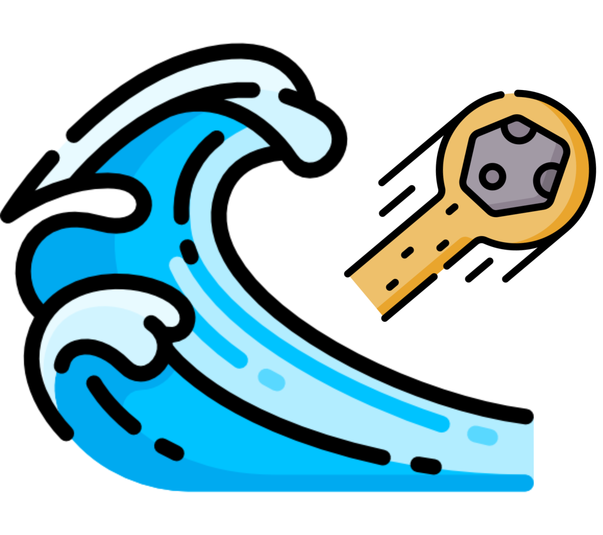

#  WaterDrift: Aligning Streaming Time Series with LLMs Rapidly for Domain Understanding

        

This code is the official PyTorch implementation of our TKDE'25 paper: [WaterDrift](https://arxiv.org/pdf/2412.10859): Aligning Streaming Time Series with LLMs Rapidly for Domain Understanding.

If you find this project helpful, please don't forget to give it a ⭐ Star to show your support. Thank you!

🚩 News

## Introduction

The RCSF simultaneously achieves CECTS with evolving distributions to form an interpretable label sequence. More specifically, the design of RCSF has the following pivotal elements. Firstly, it solves inconsistent distributions with continuous classification and adapts time-sensitive applications by the classifier and matcher of the discriminator. The classifier leverages a contract mechanism that records similarity relationships to make the execution automatic and transparent and computes using less construction cost to enhance the overall earliness. Before entering the classifier, the matcher fills in the label of the previous one if it matches the current one. Secondly, it solves the uncertain trained strategies by evaluating classifiers and co-training that alleviates the lack of labeled data from the evaluator. With effective iterative training, RCSF adapts to changes in distributions to improve the overall earliness and accuracy. Finally, it solves the unfocused classified results by finding key labels that are a high percentage generated from the instructor by attention mechanism to provide quantified labels from the instructor.
